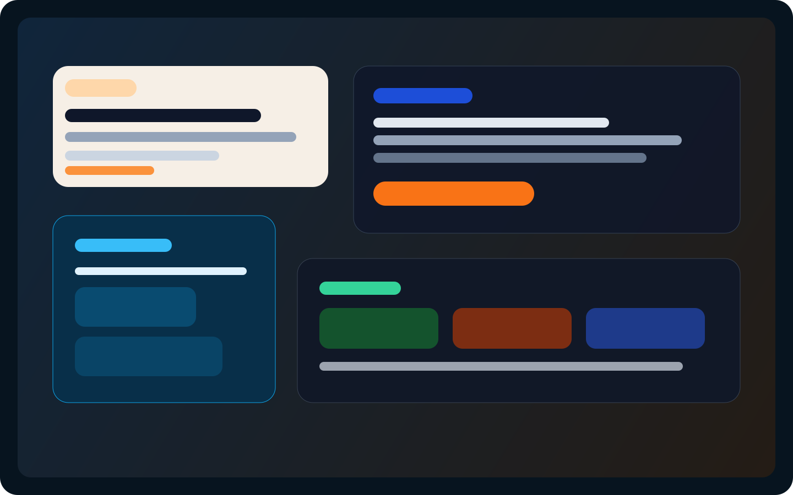

# 🎧 AudioCopilot

Fix your microphone & audio issues in 3 minutes with AI.

⚡ Detect noise, latency, clipping  
🧠 AI-powered diagnosis  
🎤 Works with OBS / Discord / Zoom

👉 Try Demo: Coming soon



AudioCopilot is an open-source toolkit for creators, streamers, podcasters, and remote teams who need fast, practical audio troubleshooting. It combines browser-based signal analysis with a structured audio troubleshooting knowledge base so users can move from "I hear static" to a concrete fix path in minutes.

## Why It Can Win

- Browser-first microphone testing with no desktop install required
- Structured "audio problem tree" instead of vague chat-only answers
- Actionable output for real tools like OBS, Discord, Zoom, and USB audio interfaces
- A clean path from open-source utility to premium tuning workflows

## Core Features

### 1. AI Audio Diagnosis

Users can type problems like:

- "有电流声"
- "声音很小"
- "直播有延迟"

AudioCopilot returns:

- Multi-path root causes
- Step-by-step troubleshooting actions
- Device-specific recommendations

### 2. One-Click Audio Detection

Users can record 5 seconds of audio in the browser and get:

- Noise floor estimate
- Clipping detection
- Mono / stereo balance check
- Rough onset latency estimate

The demo app then turns those metrics into direct findings such as:

- "You have a background noise issue"
- "Your gain is too high"
- "Your stereo channels look imbalanced"

### 3. AI Tuning Suggestions

The current MVP already generates:

- EQ direction suggestions
- Compressor starting points
- Gain / mic distance guidance

Next iterations can add:

- Visual EQ curves
- Exportable tuning presets
- OBS filter screenshot guidance

### 4. Scenario Templates

Built-in presets for:

- Gaming voice chat
- Singing
- Live selling / livestreaming
- Podcast recording

## Project Structure

```text
audiocopilot/
├── web/          # React + TypeScript + Tailwind UI
├── core/         # Browser audio analysis logic
├── ai/           # RAG-style diagnosis and recommendation layer
├── data/         # Audio troubleshooting knowledge base
├── docs/         # Demo and launch materials
```

## Tech Stack

- React + TypeScript
- Tailwind CSS
- Web Audio API
- Knowledge-base-driven diagnosis
- OpenAI API for hosted AI flows
- Ollama or other local models for the open-source offline path

## Local Development

```bash
npm install
npm run dev
```

Then open the Vite app from the `web` workspace.

## Roadmap

- [x] Browser microphone recorder
- [x] RMS / peak / clipping / noise-floor analysis
- [x] Knowledge-base-based diagnosis flow
- [x] Scenario templates
- [ ] Real RAG retrieval with embeddings
- [ ] OBS-specific visual setup guides
- [ ] Exportable presets
- [ ] OBS plugin
- [ ] Hosted demo deployment

## GitHub Launch Tips

- Add topics: `audio`, `microphone`, `obs`, `ai`, `noise-reduction`, `streaming`
- Replace the preview SVG with a real GIF before launch day
- Post before/after examples in OBS and creator communities
- Publish a short troubleshooting video with the repo in the description

## The Core Bet

This project does not win just because the model is smarter.

It wins if we turn messy audio troubleshooting experience into a reusable, structured knowledge system.

