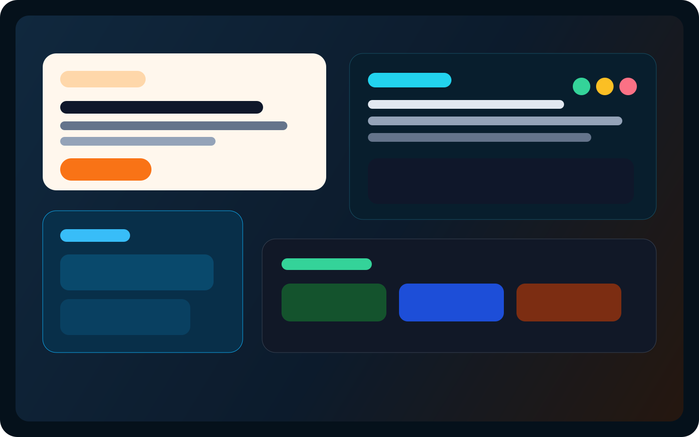
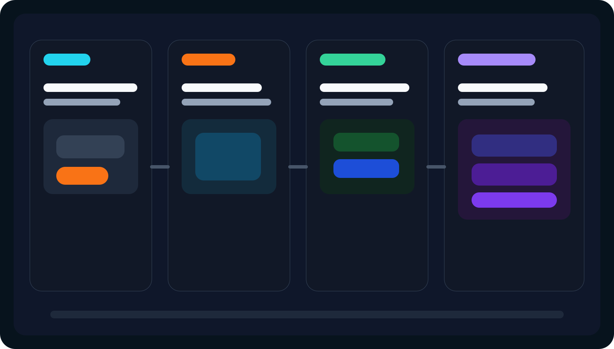

# AudioCopilot

<p align="center">
  
</p>

<p align="center">
  <strong>Fix microphone and streaming audio issues in minutes with AI.</strong>
</p>

<p align="center">
  <a href="https://github.com/wby1121/audio-copilot/stargazers"></a>
  <a href="https://github.com/wby1121/audio-copilot/blob/audio-copilot/LICENSE"></a>
  <a href="https://audio-copilot-blue.vercel.app"></a>
  
  
</p>

<p align="center">
  <a href="#english">English</a> ·
  <a href="#中文">中文</a> ·
  <a href="#日本語">日本語</a> ·
  <a href="#한국어">한국어</a> ·
  <a href="#русский">Русский</a>
</p>

<p align="center">
  <strong>Live Demo:</strong> <a href="https://audio-copilot-blue.vercel.app">audio-copilot-blue.vercel.app</a>
</p>

## Demo

<p align="center">
  
</p>

What the demo already shows:

- Type an issue like `有电流声`, `声音很小`, or `直播有延迟`
- Record 5 seconds of microphone audio in the browser
- Detect noise floor, clipping, levels, channels, and rough onset latency
- Return troubleshooting paths, tuning suggestions, and scenario presets
- Switch between `local`, `openai`, and `ollama` diagnosis modes

## English

### What It Is

AudioCopilot is an open-source AI audio troubleshooting toolkit for streamers, podcasters, creators, and remote teams. It combines browser-based signal analysis with a structured audio problem tree so users can go from "my mic has static" to an actionable fix path in a few minutes.

### Why It Stands Out

- Browser-first microphone testing with no desktop installation
- Structured diagnosis instead of vague chat-only answers
- Real creator workflows for OBS, Discord, Zoom, and livestream setups
- A clean product path from free open source utility to advanced tuning tools

### Core Features

1. AI Audio Diagnosis  
Users describe a problem and get multi-path root causes, step-by-step troubleshooting, and device-specific suggestions.

2. One-Click Audio Detection  
The app records 5 seconds of audio and analyzes RMS, peak, clipping, noise floor, channel imbalance, and rough latency.

3. AI Tuning Suggestions  
The system converts diagnosis results into EQ direction, compressor starting points, gain advice, and OBS-friendly guidance.

4. Scenario Templates  
Built-in presets for gaming, singing, livestream selling, and podcast recording.

## 中文

### 项目简介

AudioCopilot 是一个面向主播、播客、内容创作者和远程协作用户的开源 AI 音频诊断工具。它把浏览器端音频分析能力和结构化“音频问题树”结合起来，让用户从“我的麦克风有电流声”快速走到“下一步应该怎么排查和怎么调”。

### 亮点

- 浏览器里直接录音检测，不需要先装桌面软件
- 不是单纯聊天，而是结构化诊断路径
- 面向 OBS、Discord、Zoom、直播链路的真实场景
- 既能做开源工具入口，也能继续扩展成高级调音产品

### 核心功能

1. AI 音频问题诊断  
用户输入一句问题描述，系统输出问题原因、排查步骤和设备相关建议。

2. 音频一键检测  
用户录 5 秒音频后，系统自动分析音量、削波、底噪、声道状态和大致延迟。

3. AI 调音建议  
根据问题类型和音频指标生成 EQ 建议、Compressor 起始参数和 OBS 调整方向。

4. 场景模板  
内置游戏开黑、唱歌、直播带货、播客等场景的一键推荐设置。

## 日本語

### 概要

AudioCopilot は、配信者、ポッドキャスター、クリエイター向けのオープンソース AI 音声トラブルシューティングツールです。ブラウザ上の音声解析と構造化された音声問題ツリーを組み合わせ、ノイズ、音量不足、遅延などを素早く切り分けます。

### 特長

- ブラウザだけでマイクチェックが可能
- 曖昧なチャット回答ではなく、原因ごとの診断フロー
- OBS、Discord、Zoom、配信環境に直結した提案
- オープンソースから高度な音声チューニング製品へ拡張しやすい構成

## 한국어

### 소개

AudioCopilot는 스트리머, 팟캐스터, 크리에이터를 위한 오픈소스 AI 오디오 문제 진단 도구입니다. 브라우저 기반 신호 분석과 구조화된 오디오 문제 트리를 결합해 잡음, 낮은 볼륨, 지연 문제를 빠르게 진단합니다.

### 장점

- 브라우저에서 바로 5초 녹음 후 분석 가능
- 단순 채팅형 답변이 아니라 단계별 문제 해결 경로 제공
- OBS, Discord, Zoom, 라이브 환경에 맞춘 실전형 제안
- 향후 고급 튜닝, 플러그인, 유료 기능으로 확장 가능한 구조

## Русский

### О проекте

AudioCopilot — это open-source инструмент для диагностики аудиопроблем с помощью AI, созданный для стримеров, подкастеров и создателей контента. Он объединяет браузерный анализ сигнала и структурированное дерево аудиопроблем, чтобы быстро переводить жалобы вроде "есть шум" в конкретные шаги по исправлению.

### Преимущества

- Проверка микрофона прямо в браузере
- Структурированная диагностика вместо расплывчатого чата
- Практические рекомендации для OBS, Discord, Zoom и стриминга
- Хорошая основа для роста от open-source утилиты до полноценного продукта

## Features

### Diagnosis Inputs

- `有电流声`
- `声音很小`
- `直播有延迟`
- `clipping / distortion`
- `left and right channels feel wrong`

### Diagnosis Outputs

- Multi-path possible causes
- Step-by-step troubleshooting checklist
- Device-aware suggestions
- Signal health findings from recorded audio
- EQ, compressor, and OBS setup guidance

## Architecture

```text
audiocopilot/
├── web/          # React + TypeScript + Tailwind interface
├── core/         # Browser audio analysis logic
├── ai/           # RAG logic and AI provider routing
├── data/         # Structured troubleshooting knowledge base
├── api/          # Vercel serverless diagnosis endpoint
├── docs/         # Launch assets, storyboard, and docs
```

### Stack

- React + TypeScript
- Tailwind CSS
- Web Audio API
- Vite
- Vercel
- OpenAI Responses API
- OpenAI Embeddings
- Ollama local model support

## AI Modes

| Mode | What it does | When to use |
| --- | --- | --- |
| `local` | Lexical retrieval + rule-based summaries | Safe default demo mode, no API key |
| `openai` | Hybrid retrieval with embeddings + generated guidance | Best hosted AI experience |
| `ollama` | Local model generation through Ollama | Offline or open-source-first workflows |

## Project Structure

```text
web/
  src/App.tsx                 # Main product UI
core/
  src/audioAnalysis.ts        # RMS, peak, clipping, noise floor, latency estimation
ai/
  src/diagnosis.ts            # Shared client-side diagnosis logic
  server/rag.js               # Provider-aware server-side RAG pipeline
api/
  diagnose.js                 # Serverless endpoint for AI diagnosis
data/
  problem-tree.json           # Audio troubleshooting knowledge base
  scenario-templates.json     # Creator workflow presets
```

## Quick Start

### Local frontend only

```bash
npm install
npm run dev
```

### Local full stack

```bash
npm install
npm run dev:full
```

### Environment

Copy `.env.example` to `.env` and choose one mode:

```bash
AUDIOCOPILOT_AI_PROVIDER=local
OPENAI_API_KEY=
OPENAI_MODEL=gpt-5-mini
OPENAI_EMBEDDING_MODEL=text-embedding-3-small
OLLAMA_BASE_URL=http://127.0.0.1:11434
OLLAMA_MODEL=llama3.1:8b
```

## Deployment

- Production demo: [audio-copilot-blue.vercel.app](https://audio-copilot-blue.vercel.app)
- Deployment guide: [docs/deployment.md](./docs/deployment.md)
- Default production mode is `local`, so the app stays usable even without AI credentials

## Roadmap

- [x] Browser microphone recorder
- [x] Noise floor, RMS, peak, clipping, and latency estimation
- [x] Structured problem-tree diagnosis
- [x] Scenario templates for real creator workflows
- [x] Vercel deployment
- [x] Provider switching for `local`, `openai`, and `ollama`
- [ ] Real GIF capture for the homepage demo
- [ ] More device profiles and interface-specific tuning data
- [ ] Visual OBS filter guides
- [ ] Exportable presets
- [ ] OBS plugin

## Showcase Ideas

- Before / after microphone comparison cards
- OBS filter chain screenshots
- "I had static noise" to "fixed in 3 minutes" case studies
- Creator setup presets by device and use case

## Contributing

Contributions are welcome. The highest-value areas right now are:

- Expanding the audio problem tree
- Adding more device-specific troubleshooting data
- Improving latency and channel diagnostics
- Creating real capture assets for the README demo section
- Adding tests for diagnosis and retrieval logic

## License

MIT. See [LICENSE](./LICENSE).

## The Core Bet

This project does not win just because the model is smarter.

It wins if we can turn messy real-world audio troubleshooting experience into a reusable, structured knowledge system.
